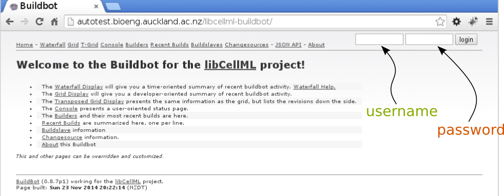
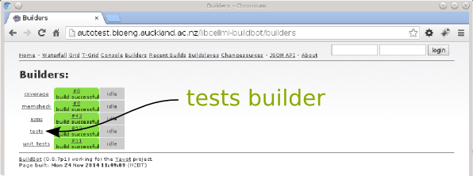
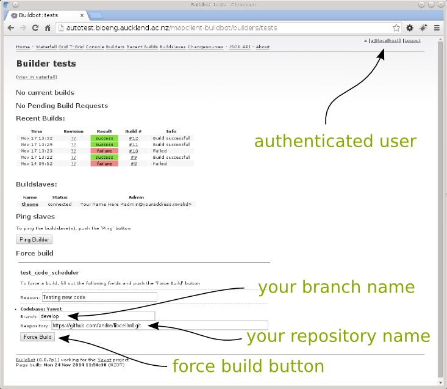

.. _Developer Contribution for CellML:

=================
Contributing Code
=================

This section describes how a developer can contribute code to the libcellml project.

.. contents:

Overview
========

Each feature must have an associated issue that it is resolving.  When a developer has taken ownership of an issue start work on the tests and create a pull request when the first test is ready.  Write tests and the implementation until the issue is resolved.  When the tests and implementation have been completed i.e. satisfying the issue open a pull request for the implementation and the documentation.  Add a reference from the tests pull request to the src and documentation pull requests thus providing a link for a reviewer to follow.  Use Buildbot to test your changes, when all tests are passing you can add a link to the successful build onto the pull request against the libcellml-tests repository.  With this action you are signalling that your work is ready for a final review and merging into the **prime** codebase.

Fixing a bug follows a similar path the only difference being that we need to write a test that triggers the bug in question.

Take Ownership
==============

Because every feature must have an associated issue leave a comment on the issue letting others know that you are intending to start work on this issue.  If an issue has not been created for the functionality that you require simply create a new one and leave a comment stating that you are working on it.

Share Progress
==============

We are following a test driven approach for the libCellML project so the first thing to do is write a test that at least covers some part of the functionality required for the feature you are working on.  Once this first test is written commit your changes and push them to Github so that your work can be shared with the community.

When the first new test is pushed to Github create a pull request against the libcellml-tests develop branch.  We do this so that other developers can comment and make suggestions on your changes.  We want to have an environment of friendly social coding where developers can offer guidance and help minimise wasted effort.

With the tests written and any comments from the community resolved write the implementation code, the implementation code is written into your copy of the libcellml-src repository.  Again commit your code and push the changes to Github.  With the new code on Github create another pull request from your repository to the develop branch in the cellml/libcellml-src repository.  Link this pull request to the pull request added for the tests by adding a comment on the libcellml-tests pull request with the following markup::

    cellml/libcellml-src#4
    
Github will interpret this markup and create a link between the pull requests for you.  Obviously replace the numeral '4' with the actual value of the related pull request for your own work.
 
Simarlarly to writing the implementation code you also need to write documentation for your changes and create a pull request from your libcellml-docs repository to cellml/libcellml-docs develop branch.  Also link the pull request to the pull request already added for the tests by adding a comment on the libcellml-tests pull request with the following markup::

    cellml/libcellml-docs#4
    
Again, replace the numeral '4' with the actual value of the related pull request for your own work.

Final Review
============

When the tests, implementation and documentation are complete use the Buildbot 'tests' builder to submit your changes and confirm your changes work across all build slaves.  See the document :doc:`Buildbot Access <developmentbuildbotaccess>` for acquiring authorisation to use the libCellML Buildbot.

**Note:** You are of course free to submit your changes to Buildbot at any time for testing not just at the final review stage.

To submit your changes first update the submodule references in your (meta) libcellml repository commit and push these changes to your repository on Github.  Once the submodule references on Github are correct login to the `libCellML Buildbot <http://autotest.bioeng.auckland.ac.nz/libcellml-buildbot/>`_ 

   
   **Figure 1**: Buildbot homepage
   
Select the builders link at the top of the Buildbot homepage (see **Figure 1**).  On the builders page (if you are authenticated) you can select the 'tests' builder (see **Figure 2**).

   
   **Figure 2**: Builders page
   
On the 'tests' builder page fill in the details for your repositories, see **Figure 3** for user Andre's values and press the 'Force Build' button.

   
   **Figure 3**: Builders page

When the 'Force Build' button is pressed Buildbot will retreive your code, configure, build and test it.  When it is finished it will email you with the outcome, the email will also include a link to the build.  If all the tests passed copy the link to the successful build in your email into the libcellml-tests pull request.  This will notify the reviewers that your work is ready for it's final review and inclusion in the cellml/libcellml repository.

When the reviewer is satisfied the three open pull requests will be merged and closed.  All that is left to do now is to thank you for your contribution.

Thank you.
 
