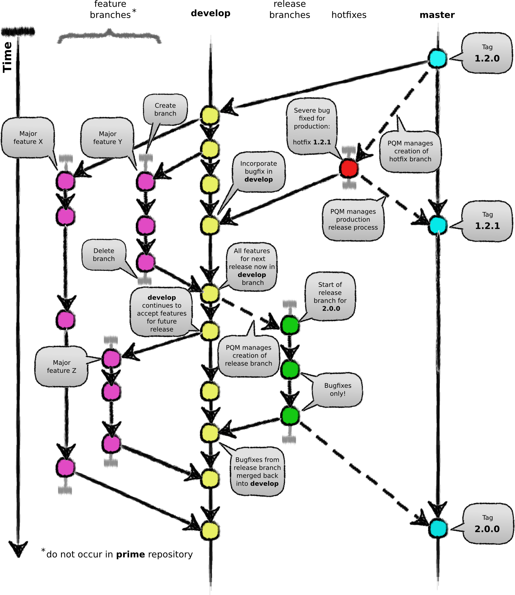

.. `Git Branching Model`

===================
Git Branching Model
===================

:Authors: David & Andre Nickerson.

This document describes the Git branching model in use by libCellML.  This model is employed by the **prime** repository it is not necessarily one that is employed by a given developer in their own repository.  

.. contents::

Overview
========

The Git branching model employed by libCellML is closely aligned with **[2]** but with some modifications.  The modifications we have added is due in part to the Git submodules present in the **prime** repository.  Also we want to automate some of the development process to ease the burden and minimise mistakes.  

The master branch is the stable branch as defined by Github - all branches should be branched from here (directly or indirectly).  For the libCellML project there's a guiding principle: anything in the master branch is always deployable.  This implies that nobody creates pull requests directly against the master branch, pull requests should be made against the development branch **develop**.  A release (or hotfix) branch is created from the **develop** branch for finalising a release.  The Patch Queue Manager (PQM) has two jobs to perform: 1. create new release (or hotfix) branch for finalising a release; 2. Merge release (or hotfix) branch into master when a new release is finalised.

   
   **Figure 1**: Overview diagram of Git branching model
    
Patch Queue Manager [b][c]
==========================

As mentioned above the PQM has two jobs:

  #. Create release (or hotfix) branch
  #. Merge release (or hotfix) branch into master
  
The PQM is the name of the device we use to manage parts of the development process.  It is used to ensure the process is followed and to reduce the workload required for creating a release.  

The PQM can be used to create a release (or hotfix) branch from the **develop** (or **master**) branch and set the version number for the upcoming release.  Before creating a new branch it will check that the status of the codebase is in a satisfactory condition.

The other role for the PQM is to merge a finalising branch into master.  The finalisation of the release means the PQM will take the branch to finalise and test this branch across the operating system and build environment matrix and after successfully passing all tests creates the release on the master branch.  This will include the creation of operating system installers, pip package on PyPi, release notes and a tag added to the master branch.

Centralised Workflow (using distributed VCS)
============================================

The repository setup for this workflow makes use of the notion of a central definitive repository.  This concept is just a notion as there is no such thing (at a technical level) as a central repository in a DVCS like Git.  We will refer to this central repository as **prime** [d][e].

Official releases are made from the master branch in *prime*.  This process is managed by the PQM which does the work for the release.  No developer should ever have to merge to the master branch.

Main Branches
=============

The definitive repository **prime** consists of two main branches with an infinite lifetime:

  * master
  * develop

The master branch is the main branch defined by Git. The develop branch runs parallel to the master branch.

We define the **prime/master** branch be the main branch where the source code is always production-ready

We define the **prime/develop** branch to be where the source code HEAD always reflects a state with the latest merged development changes for  the next release.  The continuous integration (CI) tool runs the nightly builds using this branch.  Any push to this branch will also trigger the CI tool to run an update build.

When the source code in the develop branch reaches a stable point and is ready to be released, a special temporary release branch is created via the PQM to finalise the release and free up **develop** to continue accepting new features.  When the release is finalised the PQM will handle the merge into master. How this is done in detail will be discussed further on.

Therefore, each time changes are merged into master, this is a new production release by definition.

Supporting Branches
===================

We define a variety of supporting branches for this development model:

  * Feature branches
  * Release branches
  * Hotfix branches

Each of these branches has a specific purpose and are bound by rules as to which branches may be their parent branches and which branches can be their merge targets.

These branches are special only as far as this document says so, they are standard Git branches at the end of the day.  Here we are categorizing them by their use.

Feature Branches
----------------

* branches from: develop
* merges to: develop
* naming convention: anything except master, develop, release-*, hotfix-*

Feature branches are used to develop new features.  When starting a development of a feature it should have at least one issue that can be associated with it.  Create a pull request from the feature branch to **prime/develop**.  This will let other developers know that you are working on a particular issue.  See :doc:`Development Contribution <developmentcontribution>` for detailed information on this part of the development process.

Feature branches should never occur in the **prime** repository[f][g][h].  

Creating a feature branch
^^^^^^^^^^^^^^^^^^^^^^^^^

Feature branches are created in the standard manner for creating Git branches::

        $ git checkout -b myfeature develop

Finishing a complete feature
^^^^^^^^^^^^^^^^^^^^^^^^^^^^

To finish a complete feature you need to show that the new feature passes all tests and satisfies at least one reviewer.  Add a link to the Buildbot showing the build where all tests have passed in your pull request.  When the reviewer has merged and closed your pull request delete your feature branch::

        $ git branch -d myfeature

Release Branches
----------------

* branches from: develop
* merges to: develop and master
* naming convention: release-*

Release branches are for finalising new production releases.   They allow for preparing release meta-data setting version number, release-notes, minor bug fixes etc.  This work is done on a release branch to clear **develop** to receive new features for the next release.

The release branch is created when **develop** contains all the desired features for the next release.  When this point in development is reached the release branch is branched from **develop**.  

It is at the start of a release branch that the version number for that release is assigned.

Creating release branch
^^^^^^^^^^^^^^^^^^^^^^^

The PQM is responsible for creating release branches the task it performs in creating a release branch is given below::

        $ git checkout -b release-0.1.0 develop
        Switch to branch *release-0.1.0*
        $ # Change version number in files (through a script)
        $ git commit -a -m *Set version number to 0.1.0*
        Commit the version bump

The PQM uses a script to change the version number and makes the first commit to the release branch.  At this point the preparation for roll out continues until complete.  Small bug fixes are allowed but strictly no new feature additions.

Finalising a release branch
^^^^^^^^^^^^^^^^^^^^^^^^^^^

To finalise a release branch we need to do three things merge the release branch into master as we are creating a new software release, we also need to merge changes back into develop (which will probably result in a conflict) and we also need to delete the release branch.

First the merge to master.  For this we use the PQM which will checkout the release branch and run the tests and merge and tag the release into master.  It will perform the following steps assuming the tests have passed::

        $ git checkout master
        Switch to branch *master*
        $ git merge --no-ff release-0.1.0
        Merge in the release
        $ git tag -a 0.1.0
        Tag the release with the release number

Second merge the changes back into develop::

        $ git checkout develop
        Switch to branch *develop*
        $ git merge --no-ff release-0.1.0
        Merge in the release, quite likely to hit a merge conflict
        
Thirdly delete the branch::
        
        $ git branch -d release-0.1.0
        Remove the release-0.1.0 branch

As already mentioned this step may lead to a merge conflict so it must be done manually.  The conflicts will need to be resolved before the merge can be completed.

Hotfix Branches
---------------

* branches from: master
* merges to: develop and master
* naming convention: hotfix-*

Hotfix branches are similar to release branches, just not planned.  They arise from an undesirable state in a production release.  Hotfix branches are branched from a corresponding tag on master.

Creating a hotfix branch
^^^^^^^^^^^^^^^^^^^^^^^^

The PQM is responsible for creating hotfix branches the task it performs in creating a hotfix branch is given below::

        $ git checkout -b hotfix-0.1.1 master
        Switch to branch *hotfix-0.1.1*
        $ # Change version number in files (maybe through a script)
        $ git commit -a -m *Set version number to 0.1.1*
        Commit the version bump
        $ git commit -m *Fixed major issue in amazingly quick time.*
        Fix the severe problem

Finalising a hotfix branch
^^^^^^^^^^^^^^^^^^^^^^^^^^

To finalise a hotfix branch we need to do three things merge the branch into master as we are creating a new software release, we also need to merge changes back into develop (which will probably result in a conflict) and finally we need to delete the branch.

First the merge to master.  For this we use the PQM that will checkout the hotfix branch and run the tests and merge and tag the hotfix into master.  It will perform the following steps assuming the tests have passed::

        $ git checkout master
        Switch to branch *master*
        $ git merge --no-ff hotfix-0.1.1
        Merge in the release
        $ git tag -a 0.1.1
        Tag the release with the release number

Second merge the changes back into develop::

        $ git checkout develop
        Switch to branch *develop*
        $ git merge --no-ff hotfix-0.1.1
        Merge in the release, quite likely to hit a merge conflict
        
Third delete the branch::

        $ git branch -d hotfix-0.1.1
        Remove the hotfix branch

Rule Summary
============

#. Anything in master is always deployable
#. Only the PQM merges to master
#. Release branches are named release-*
#. Release branches are branched from develop
#. Release branches are merged into master using the PQM
#. Release branches are merged back into develop and deleted
#. Hotfix branches are named hotfix-*
#. Hotfix branches are branched from master
#. Hotfix branches are merged into master using the PQM
#. Hotfix branches are merged back into develop and deleted
#. Feature branches are named anything except: master, develop, release-*, hotfix-*
#. Feature branches are branched from and merged into develop only
#. Feature branches are never created in the **prime** repository

References
==========

**[1]** https://guides.github.com/introduction/flow/index.html

**[2]** http://nvie.com/posts/a-successful-git-branching-model/

[a] Need to address this paragraph not quite clear what I'm trying to get across.  And it doesn't tie in well to the rest of the document

[b] Jobs

  - check all tests have passed
  - create OS appropriate installers
  - update PyPi
  - Accessible through Buildbot force scheduler

[c] merge into origin/master

[d] won't this get confusing? as all forks on github that are cloned will have their own "origin"...or forks are discouraged?

[e] I refer to origin in this document not such a global outlook, I though this might need to be clarified further.  I haven't got a name for the main central definitive in all the world repo. yet.

[f] should only occur in the origin repository when being merged in? or  a pull request comes directly from a fork and then its merged in from there?

[g] Picture to come, but check out the first image whoa it's awesome.

[h] super awesome!

