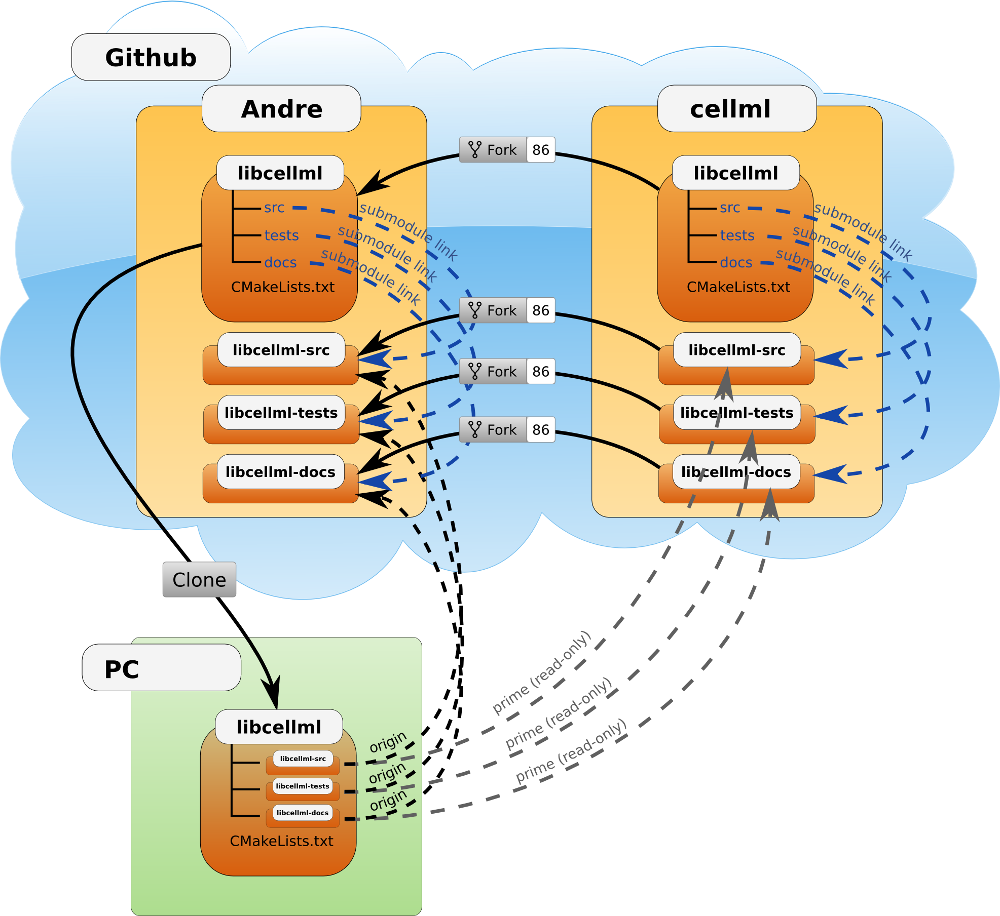

=================
Development Setup
=================

Authors: Hugh Sorby, David & Andre Nickerson.

This document describes how someone wanting to contribute to the libCellML project should set up their *working copy* for developing libCellML.

.. contents::

Overview
========

libCellML makes use of Git submodules to modularise the source code, tests and documentation.  For this reason the development setup requires a small amount of work before development can begin.  Please follow the steps below to setup up your development environment. Before you begin you will need to have a few prerequisites satisfied:

#. Github user account (for the rest of this document we will call our user *andre*)
#. Git installed and available from the command line

This document doesn't cover the process of satisfying these prerequisites, it is left as an exercise for you (Google is your friend).  The remainder of this document assumes that these prerequisites have been met.

The goal here is to get a working copy of source code, tests, and documentation onto your PC so that you can begin development.  To make this happen you will need to fork the prime libcellml repository, make a clone onto your PC, initialise the submodules, and set up the Git remotes.  In **Figure 1** you can see a pictorial representation of what you are going to achieve. 

   
   **Figure 1**: Setup of repositories for development

The four steps to getting set up are detailed below.

Forking your own copy
=====================

For contributors there are four git repositories that need to be forked:

#. libcellml, the meta repository that contains our submodules;
#. libcellml-src, the source code repository;
#. libcellml-tests, the test repository; and
#. libcellml-docs, the documentation.

Login to Github with your username and go to::

        https://github.com/MusculoskeletalAtlasProject

and for the four repositories given above fork them into your own Github user account.

Clone
=====

You now need to clone the libcellml repository to your PC.  You do this by going to your fork (in this example user andre's fork) at:

        https://github.com/andre/libcellml

**Note**: Don't try and clone this location substitute your Github username for *andre*.

On the right hand side of the webpage on your fork of the repository you can get the link for cloning the repository to your PC, in our example::

        git@github.com:andre/libcellml.git

Now clone the repository::

        cd /somewhere/you/keep/development/code
        git clone git@github.com:andre/libcellml.git

Note: Again, don't and clone this location substitute your username for *andre*.

Initialise submodules
=====================

You need to initialise the submodules as all you have at this point is the submodule framework.  Assuming you are still in the directory where you ran the *git clone* command above, do the following::

        cd libcellml
        git submodule update --init

You have now recursively initialised the submodules, next you need to set the submodule location to point to your users Github repositories.  To do this open the file .gitmodules in your favourite text editor and change the url location of each module from the prime repository url to your username based url.  In our example you start with the following::

    [submodule "src"]
        path = src
        url = git@github.com:cellml/libcellml-src.git
    [submodule "tests"]
        path = tests
        url = git@github.com:cellml/libcellml-tests.git
    [submodule "docs"]
        path = docs
        url = git@github.com:cellml/libcellml-docs.git

and end up with::

    [submodule "src"]
        path = src
        url = git@github.com:andre/libcellml-src.git
    [submodule "tests"]
        path = tests
        url = git@github.com:andre/libcellml-tests.git
    [submodule "docs"]
        path = docs
        url = git@github.com:andre/libcellml-docs.git

Save the changes back to the .gitmodules file and then synchronise these changes by executing the command::

    git submodule sync
    
You will now commit and push these changes to your own repository at Github, this is done so that Buildbot can test your future changes::

    git add .gitmodules
    git commit -m "Updating submodule url references"
    git push
    
all that remains is to setup the git remotes.

Set Git remotes
===============

You now need to setup a read-only remote connection to the prime repository.  Given that you are still in the *libcellml* directory where you initialised the submodules, do the following::

        cd docs
        git checkout master
        git remote add prime git@github.com:cellml/libcellml-docs.git
        git config remote.prime.pushurl "you really didn't want to do that"

You now need to repeat this procedure for the src and tests repositories.  In full (starting from the docs directory)::

        cd ../src  
        git checkout master
        git remote add prime git@github.com:cellml/libcellml-src.git
        git config remote.prime.pushurl "you really didn't want to do that"

        cd ../tests
        git checkout master
        git remote add prime git@github.com:cellml/libcellml-tests.git
        git config remote.prime.pushurl "you really didn't want to do that"

You have now added a new remote to all the submodules named **prime** and set origin as the default fetch and push location to point at repositories under your control on Github.  Here **prime** is a reference to the main definitive repositories where releases are made from for the libcellml project.  You have also set the **prime** repository as read-only by setting an invalid push url.

Finally
=======

You are all done and ready to start development, read :doc:`Contributing <developmentcontribution>` on how to get your changes into the https://github.com/cellml/libcellml repository
